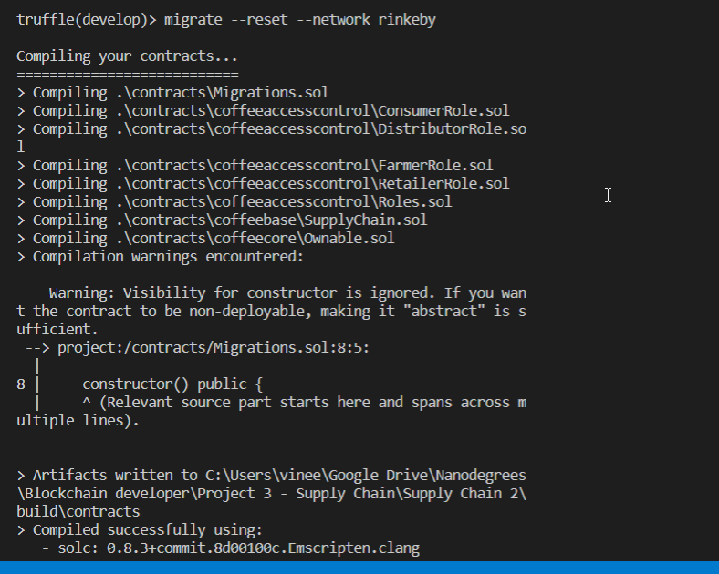

# Udacity Blockchain Developer Nanodegree Program - Project 3: Ethereum DApp for Tracking Items through Supply Chain

This project implements a Supply Chain. 

The Ethereum DApp demonstrates a Coffe beans Supply Chain flow between a farmer and consumer through distributors and retailers. A farmer can add items to the inventory system stored in the blockchain. A buyer can purchase such items from the inventory system. A distributor can mark an item as shipped, and similarly a consumer can mark an item as received.

## UML diagrams

The diagrams folder contains the UML diagrams for the supply chain.

### Activity diagram


### Sequence diagram


### State diagram


### Classes diagram


## Getting Started

These instructions will get you a copy of the project up and running on your local machine for development and testing purposes.

### Prerequisites

Please make sure you've already installed Truffle and enabled the MetaMask extension in your browser.

### Installing

Clone this repository and install all requisite npm packages (as listed in ```package.json```):

```
npm install
```

Launch Truffle development environment:

```
truffle develop
```
Your terminal should look something like this:


Notice that the truffle developement environment gives us 10 accounts to work with the blockchain locally. We will use these accounts to simulate an owner account[0], a farmer (account[1]), a distributor (account[2]), a retailer (account[3]) and a consumer (account[4]). Copy the public keys of these accounts in app/src/index.js file in the ownerId, farmerId, distributorId, retailerId and consumerId constants.


Compile contracts

```
compile
```

Your terminal should look something like this:


This will create the smart contract artifacts in folder ```build/contracts```.

Migrate smart contracts to the locally running blockchain:

```
migrate
```

Your terminal should look something like this:


Test smart contracts:migrate

```
test
```

All 10 tests should pass.


In a separate terminal window, launch the DApp:

```
npm run dev
```
Your terminal should look something like this:


## Testing the DApp in the browser

Go to [http://localhost:8080/](http://localhost:8080/) to open the DApp in the browser:


Use the accounts' private keys to import accounts in metamask. Now connect to the Contract Owner account and register the other accounts in the DApp:


The transaction history should look like this:


Now select the Farmer account in MetaMask to harvest, process, pack and put the coffee beans up for sale:


Go through the following steps to simulate the supply chain process.
1. Select the Distributor account in MetaMask to buy and mark the coffee beans for shipping. Make sure to put enough money in payment field to account for coffe price and gas price.
2. Select the Retailer account to receive the coffee beans. 
3. Finally with the Consumer account, the coffee beans can be purchased.


Transaction history


## Deploy smart contract on a public test network (Rinkeby)




The smart contract is deployed on the Ethereum Rinkeby test network:
* Transaction ID: 0x2ede7496c1a702659646d8c57d72b4fad10bea565b38ce8d8154312ca45a990a
* Contract address: 0x15e54493feadb8bD5420C41D5D0915C937c59945

You can [view the contract in Etherscan](https://rinkeby.etherscan.io/address/0x15e54493feadb8bD5420C41D5D0915C937c59945).

## Requirements

Graded according to the [Project Rubric](https://review.udacity.com/#!/rubrics/1710/view).

## Built With

* [Ethereum](https://www.ethereum.org/) - Ethereum is a decentralized platform that runs smart contracts
* [Truffle Framework](http://truffleframework.com/) - Truffle is the most popular development framework for Ethereum with a mission to make your life a whole lot easier.

## Versions

* Truffle v5.4.13
* Solidity v0.8.0 (solc-js)
* Web3 v1.2.4
* @openzeppelin/test-helpers v0.5.15
* truffle-hdwallet-provider v1.0.17
* Node v14.15.1

## License

- **[MIT license](http://opensource.org/licenses/mit-license.php)**
